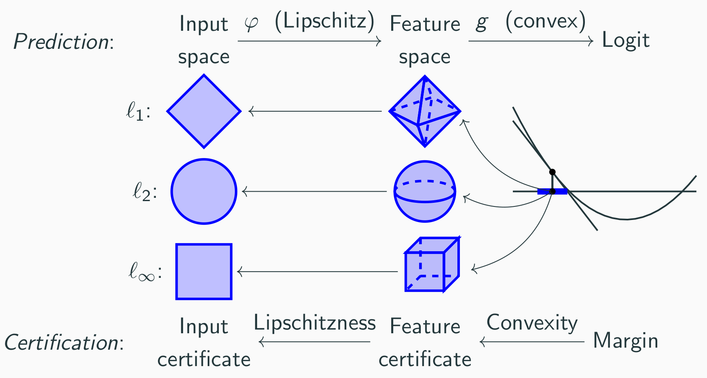

# Asymmetric Certified Robustness via Feature-Convex Neural Networks 

This code accompanies our paper:

**Asymmetric Certified Robustness via Feature-Convex Neural Networks**\
Samuel Pfrommer\*, Brendon G. Anderson\*, Julien Piet, Somayeh Sojoudi\
37th Conference on Neural Information Processing Systems (NeurIPS 2023).




## Installation
This code was developed for Python 3.7.5 and is easiest to reproduce using [virtualenvwrapper](https://virtualenvwrapper.readthedocs.io/en/latest/). After creating the virtual environment, simply run `bash setup.sh`.

Reproducing the convex combination experiments in Appendix C requires a working MOSEK install and license as documented [here](https://docs.mosek.com/latest/install/installation.html) -- this license is freely available for academic researchers.

## Key implementations
The base class for all convexly certified methods lies in `convexrobust/model/convex_certifiable.py`, with specific subclass instantiations lying in `convexrobust/model/insts/convex.py`. The file `convexrobust/model/modules.py` contains implementations of ICNN MLPs and convnets.

## Execution
To reproduce the main experiments of the paper, `cd` to the `convexrobust/main` directory and run `python main.py --data=mnist_38 --train`, where the `data` option is one of `mnist_38`, `fashion_mnist_shirts`, `malimg`, or `cifar10_catsdogs`. The figure papers can then be produced with `python plot.py --data=mnist_38 --labels=mnist_38_paper` (change accordingly) and should lie in `convexrobust/main/figs/`.

To reproduce the convex combination experiments, enter the `scripts/misc` directory and execute `reconstruction_main.py` and `reconstruction_plot.py`. The same directory also contains the malimg multiclass experiments and the mnist sweep experiments from the Appendix.

For convenience, `scripts/misc/simple_example.py` contains a minimal script to train and certify a convex network.

### Running linf-distance nets
To compare against $\ell_{\infty}$-distance nets, first activate your virtual environment. Then ensure that the `CUDA_HOME` environment variable is set to your cuda install, and run the following:
```
cd lib/linf_dist
python setup.py install --user
pip install -e .
```
Note that by default the $\ell_{\infty}$-distance net comparisons are commented out in `main.py`.

### Running abCROWN
After running the above, we can execute the $\alpha,\beta$-CROWN verifier, which runs separately. First, install as follows into a separate conda environment:

```
cd lib/alpha-beta-CROWN
conda env create -f complete_verifier/environment.yml --name alpha-beta-crown
conda activate alpha-beta-crown
conda develop .
cd ../..
bash setup_abcrown.sh
```
Note that we need to run a different setup script to be compatible with the alpha-beta-CROWN package versions.

After the $\alpha,\beta$-CROWN install has finished, simply run `bash scripts/abcrown/xxx.sh` from the root directory. The certified will be populated automatically into the appropriate results file. Replotting should then show the abCROWN certified accuracy curve.
